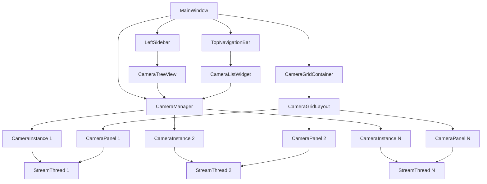

# Design Document: Multi-Camera Display Enhancement

## Overview

This design document outlines the architecture and implementation approach for enhancing the IP Camera Player application UI to match professional surveillance software styling (Viewtron-style interface). The enhancement transforms the application's user interface to include a left sidebar with camera tree navigation, a top menu bar with system controls, and an improved grid display with professional dark theme styling.

The design introduces new UI components while maintaining the existing modular architecture that separates camera management, display layout, and individual camera control. Each camera operates independently with its own streaming thread, state management, and error handling. The new UI provides a professional surveillance system appearance with improved navigation and visual hierarchy.

## Architecture

### High-Level Architecture

The multi-camera enhancement follows a Model-View-Controller (MVC) pattern:

**Model Layer:**
- `CameraInstance`: Represents a single camera configuration and state
- `CameraManager`: Manages the collection of camera instances and persistence
- `StreamThread`: Handles video capture for individual cameras (existing, enhanced)

**View Layer:**
- `CameraPanel`: Widget displaying a single camera stream
- `CameraGridLayout`: Custom layout manager for arranging camera panels
- `CameraListWidget`: Settings UI for managing camera configurations
- `MainWindow`: Application window coordinating all components (existing, enhanced)

**Controller Layer:**
- Event handlers for user interactions (selection, drag-drop, controls)
- Signal/slot connections between components
- State management for camera operations

### Component Interaction Flow



## Components and Interfaces

### CameraInstance

Represents a single camera with its configuration and runtime state.

**Attributes:**
- `id`: Unique identifier (UUID)
- `name`: User-friendly camera name
- `protocol`: Connection protocol (e.g., "rtsp")
- `username`: Authentication username
- `password`: Authentication password
- `ip_address`: Camera IP address
- `port`: Connection port
- `stream_path`: RTSP stream path
- `resolution`: Video resolution tuple (width, height)
- `stream_thread`: Associated StreamThread instance
- `state`: Current state (STOPPED, STARTING, RUNNING, PAUSED, ERROR)
- `error_message`: Last error message if state is ERROR

**Methods:**
- `to_dict()`: Serialize to dictionary for persistence
- `from_dict(data)`: Deserialize from dictionary
- `get_url()`: Construct RTSP URL from configuration
- `start_stream()`: Initiate streaming
- `stop_stream()`: Stop streaming
- `pause_stream(paused)`: Pause/unpause streaming
- `take_snapshot()`: Capture current frame

### CameraManager

Manages the collection of camera instances and handles persistence.

**Attributes:**
- `cameras`: List of CameraInstance objects
- `settings`: QSettings instance for persistence
- `selected_camera_id`: ID of currently selected camera

**Methods:**
- `add_camera(config)`: Add new camera instance
- `remove_camera(camera_id)`: Remove camera instance
- `get_camera(camera_id)`: Retrieve camera by ID
- `get_all_cameras()`: Return list of all cameras
- `reorder_cameras(camera_id, new_index)`: Change camera order
- `select_camera(camera_id)`: Set selected camera
- `get_selected_camera()`: Return selected camera instance
- `save_to_settings()`: Persist all cameras to QSettings
- `load_from_settings()`: Load cameras from QSettings

**Signals:**
- `camera_added(camera_id)`
- `camera_removed(camera_id)`
- `camera_updated(camera_id)`
- `cameras_reordered()`
- `selection_changed(camera_id)`

### CameraPanel

Custom QWidget displaying a single camera stream with selection and drag-drop support.

**Attributes:**
- `camera_instance`: Associated CameraInstance
- `video_label`: QLabel for video display
- `loading_animation`: LoadingAnimation instance
- `error_label`: QLabel for error messages
- `is_selected`: Selection state flag
- `is_fullscreen`: Fullscreen state flag
- `zoom_factor`: Current zoom level
- `pan_offset`: Pan position (x, y)

**Methods:**
- `set_frame(frame)`: Update displayed video frame
- `set_selected(selected)`: Update selection visual state
- `set_loading(loading)`: Show/hide loading animation
- `set_error(message)`: Display error message
- `enter_fullscreen()`: Expand to fullscreen
- `exit_fullscreen()`: Return to grid layout
- `mousePressEvent()`: Handle selection and drag initiation
- `mouseDoubleClickEvent()`: Handle fullscreen toggle
- `paintEvent()`: Custom painting for selection border

**Signals:**
- `clicked(camera_id)`
- `double_clicked(camera_id)`
- `drag_started(camera_id)`
- `drop_requested(source_id, target_id)`

### CameraGridLayout

Custom QLayout that arranges camera panels in an optimal grid.

**Attributes:**
- `items`: List of layout items (camera panels)
- `fullscreen_item`: Currently fullscreen item (if any)

**Methods:**
- `addItem(item)`: Add camera panel to layout
- `removeItem(item)`: Remove camera panel from layout
- `calculate_grid_dimensions(count)`: Determine optimal rows/columns
- `setGeometry(rect)`: Position all camera panels
- `set_fullscreen(item)`: Set one panel to fullscreen
- `clear_fullscreen()`: Return to grid layout
- `swap_items(index1, index2)`: Swap panel positions

**Grid Calculation Logic:**
- For N cameras, calculate rows and columns to minimize wasted space
- Prefer wider layouts (more columns than rows)
- Examples: 1→1x1, 2→1x2, 3→1x3, 4→2x2, 5→2x3, 6→2x3, 7→2x4, 8→2x4, 9→3x3

### CameraListWidget

Dialog for managing camera configurations (enhanced from CameraSettings).

**Attributes:**
- `camera_manager`: Reference to CameraManager
- `camera_list_view`: QListWidget showing all cameras
- `add_button`: Button to add new camera
- `edit_button`: Button to edit selected camera
- `delete_button`: Button to delete selected camera
- `close_button`: Button to close dialog

**Methods:**
- `refresh_list()`: Update displayed camera list
- `show_camera_form(camera_id)`: Show add/edit form
- `handle_add()`: Handle add button click
- `handle_edit()`: Handle edit button click
- `handle_delete()`: Handle delete button click

### TopNavigationBar

Custom QWidget providing the top navigation bar with branding and system controls.

**Attributes:**
- `app_logo`: QLabel displaying application logo/icon
- `app_title`: QLabel displaying application name
- `menu_buttons`: List of QPushButton for menu items
- `status_indicators`: Dictionary of status indicator widgets

**Methods:**
- `add_menu_button(text, callback)`: Add a menu button
- `add_status_indicator(name, widget)`: Add a status indicator
- `update_status(name, value)`: Update a status indicator
- `set_branding(logo_path, title)`: Set application branding

**Signals:**
- `menu_clicked(menu_name)`: Emitted when a menu button is clicked

### LeftSidebar

Custom QWidget providing the left sidebar with camera tree navigation.

**Attributes:**
- `camera_tree_view`: CameraTreeView instance
- `collapse_button`: QPushButton to collapse/expand sidebar
- `is_collapsed`: Boolean indicating collapsed state
- `expanded_width`: Width when expanded (default: 250)
- `collapsed_width`: Width when collapsed (default: 40)

**Methods:**
- `toggle_collapse()`: Toggle sidebar collapsed state
- `set_collapsed(collapsed)`: Set collapsed state
- `get_tree_view()`: Return the camera tree view

**Signals:**
- `collapsed_changed(is_collapsed)`: Emitted when collapse state changes

### CameraTreeView

Custom QTreeWidget displaying cameras organized by location.

**Attributes:**
- `camera_manager`: Reference to CameraManager
- `location_nodes`: Dictionary mapping location names to tree nodes
- `camera_items`: Dictionary mapping camera IDs to tree items

**Methods:**
- `refresh_tree()`: Rebuild tree from camera manager
- `add_location(location_name)`: Add a location node
- `add_camera_to_location(camera, location)`: Add camera to location node
- `get_selected_camera_id()`: Return selected camera ID
- `select_camera(camera_id)`: Select camera in tree

**Signals:**
- `camera_selected(camera_id)`: Emitted when camera is clicked
- `camera_double_clicked(camera_id)`: Emitted when camera is double-clicked

### CameraConfigDialog

Dialog for adding/editing individual camera configuration.

**Attributes:**
- Form fields for all camera properties (protocol, IP, port, etc.)
- `save_button`: Save configuration
- `cancel_button`: Cancel operation

**Methods:**
- `load_camera(camera_instance)`: Populate form with existing camera
- `get_camera_data()`: Extract form data as dictionary
- `validate()`: Validate form inputs

### Enhanced MainWindow

The existing Windows class enhanced with multi-camera support and new UI layout.

**New Attributes:**
- `camera_manager`: CameraManager instance
- `top_nav_bar`: TopNavigationBar instance
- `left_sidebar`: LeftSidebar instance
- `camera_grid_container`: QWidget containing the grid
- `camera_grid_layout`: CameraGridLayout instance
- `camera_panels`: Dictionary mapping camera_id to CameraPanel
- `central_widget`: QWidget serving as central widget
- `main_layout`: QHBoxLayout for sidebar and content area

**Modified Methods:**
- `init_gui()`: Setup new UI layout with sidebar, top bar, and grid
- `start_streaming()`: Start selected camera only
- `stop_streaming()`: Stop selected camera only
- `pause_streaming()`: Pause selected camera only
- `take_snapshot()`: Snapshot from selected camera only
- `open_camera_settings()`: Open CameraListWidget instead of single camera dialog

**New Methods:**
- `create_camera_panel(camera_instance)`: Create panel for camera
- `remove_camera_panel(camera_id)`: Remove panel for camera
- `handle_camera_selection(camera_id)`: Update selected camera
- `handle_camera_reorder(source_id, target_id)`: Reorder cameras
- `handle_fullscreen_toggle(camera_id)`: Toggle fullscreen for camera
- `update_control_buttons()`: Enable/disable based on selection
- `handle_sidebar_collapse(is_collapsed)`: Handle sidebar collapse/expand
- `handle_tree_camera_selection(camera_id)`: Handle camera selection from tree
- `apply_dark_theme()`: Apply professional dark theme styling

## Data Models

### Camera Configuration Data Structure

```python
{
    "id": "uuid-string",
    "name": "Front Door Camera",
    "location": "Home_IP_A482_Front",  # Location/group for tree organization
    "protocol": "rtsp",
    "username": "admin",
    "password": "encrypted_password",
    "ip_address": "192.168.1.100",
    "port": 554,
    "stream_path": "stream1",
    "resolution": "(1920, 1080)",
    "order_index": 0
}
```

### Persistence Format

Cameras are stored in QSettings as a JSON array under the key "cameras":

```python
{
    "cameras": [
        {camera_config_1},
        {camera_config_2},
        ...
    ],
    "selected_camera_id": "uuid-string"
}
```

### Camera State Enumeration

```python
class CameraState(Enum):
    STOPPED = "stopped"
    STARTING = "starting"
    RUNNING = "running"
    PAUSED = "paused"
    ERROR = "error"
```


## Correctness Properties

*A property is a characteristic or behavior that should hold true across all valid executions of a system—essentially, a formal statement about what the system should do. Properties serve as the bridge between human-readable specifications and machine-verifiable correctness guarantees.*

### Property 1: Camera addition persistence
*For any* valid camera configuration, when added to the camera list, querying persistent storage should immediately return that camera configuration.
**Validates: Requirements 1.3, 1.5**

### Property 2: Invalid camera rejection
*For any* camera configuration with missing required fields, attempting to add it should be rejected and the camera list should remain unchanged.
**Validates: Requirements 1.4**

### Property 3: Camera deletion removes from list
*For any* camera in the camera list, deleting it should result in that camera no longer appearing in the camera list.
**Validates: Requirements 2.2**

### Property 4: Deletion persistence
*For any* camera deletion operation, the updated camera list should be immediately reflected in persistent storage.
**Validates: Requirements 2.3**

### Property 5: Streaming camera deletion stops stream
*For any* camera that is currently streaming, deleting it should result in the stream being stopped before the camera is removed.
**Validates: Requirements 2.4**

### Property 6: All cameras displayed on startup
*For any* set of configured cameras, starting the application should result in all cameras appearing in the camera grid.
**Validates: Requirements 3.1**

### Property 7: Grid layout optimization
*For any* number N of cameras, the grid layout should arrange them in rows and columns such that the layout minimizes wasted space according to the grid calculation algorithm.
**Validates: Requirements 3.2**

### Property 8: Dynamic layout recalculation
*For any* camera list, adding or removing a camera should trigger a grid layout recalculation that accommodates the new camera count.
**Validates: Requirements 3.3**

### Property 9: Aspect ratio preservation
*For any* video stream with a given aspect ratio, displaying it in a camera panel should maintain that aspect ratio regardless of panel size.
**Validates: Requirements 3.4**

### Property 10: Camera position swap
*For any* two cameras in the grid, performing a drag-and-drop swap operation should result in their positions being exchanged.
**Validates: Requirements 4.3**

### Property 11: Reorder persistence
*For any* camera reordering operation, the new order should be immediately reflected in persistent storage.
**Validates: Requirements 4.4**

### Property 12: Drag cancellation restores position
*For any* camera panel, cancelling a drag operation should result in the panel returning to its original position.
**Validates: Requirements 4.5**

### Property 13: Camera selection updates state
*For any* camera panel, clicking on it should result in that camera becoming the selected camera.
**Validates: Requirements 5.1**

### Property 14: Selection switching
*For any* sequence of camera panel clicks, the selected camera should always be the most recently clicked camera.
**Validates: Requirements 5.3**

### Property 15: Selection persistence
*For any* selected camera, if no other camera is clicked, the selection should remain unchanged.
**Validates: Requirements 5.4**

### Property 16: Selected camera deletion clears selection
*For any* selected camera, deleting it should result in the selection state being cleared.
**Validates: Requirements 5.5**

### Property 17: Fullscreen expansion
*For any* camera panel, double-clicking it should result in that panel expanding to fill the entire application window.
**Validates: Requirements 6.1**

### Property 18: Fullscreen hides other panels
*For any* camera panel in fullscreen mode, all other camera panels should be hidden from view.
**Validates: Requirements 6.2**

### Property 19: Fullscreen round-trip
*For any* camera panel, entering fullscreen mode and then exiting should restore the original grid layout with all cameras in their previous positions.
**Validates: Requirements 6.3, 6.5**

### Property 20: Fullscreen preserves zoom and pan
*For any* camera panel with zoom and pan settings, entering fullscreen mode should preserve those settings.
**Validates: Requirements 6.4**

### Property 21: Control operates on selected camera only
*For any* control operation (start, stop, pause, snapshot), the operation should affect only the currently selected camera and no other cameras.
**Validates: Requirements 7.1, 7.2, 7.3, 7.4**

### Property 22: Camera state independence
*For any* camera, changing its state (start, stop, pause) should not affect the state of any other camera.
**Validates: Requirements 8.1, 8.2, 8.3**

### Property 23: Application close stops all streams
*For any* set of cameras with active streams, closing the application should result in all streams being stopped.
**Validates: Requirements 8.4**

### Property 24: Startup initializes stopped state
*For any* set of configured cameras, starting the application should initialize all cameras in a stopped state.
**Validates: Requirements 8.5**

### Property 25: Configuration persistence round-trip
*For any* set of camera configurations, saving them to persistent storage and then loading them should produce equivalent camera configurations.
**Validates: Requirements 9.1, 9.2**

### Property 26: Order change persistence
*For any* camera order change, the new order should be immediately persisted and retrievable from storage.
**Validates: Requirements 9.3**

### Property 27: Add/delete persistence
*For any* camera add or delete operation, the updated camera list should be immediately persisted to storage.
**Validates: Requirements 9.4**

### Property 28: Loading animation during connection
*For any* camera beginning a connection attempt, a loading animation should be displayed in that camera's panel.
**Validates: Requirements 10.1**

### Property 29: Successful connection hides loading
*For any* camera that successfully connects, the loading animation should be hidden and the video stream should be displayed.
**Validates: Requirements 10.2**

### Property 30: Connection failure displays error
*For any* camera that fails to connect, an error message should be displayed in that camera's panel.
**Validates: Requirements 10.3**

### Property 31: Error isolation between cameras
*For any* camera encountering a streaming error, the error should be displayed only in that camera's panel without affecting other cameras.
**Validates: Requirements 10.4**

### Property 32: Error retry capability
*For any* camera displaying an error, the user should be able to retry the connection for that specific camera.
**Validates: Requirements 10.5**

## Error Handling

### Connection Errors

**Camera Connection Timeout:**
- Each camera has independent timeout handling
- Display error message in specific camera panel
- Allow retry without affecting other cameras
- Log error details for debugging

**Invalid Credentials:**
- Detect authentication failures
- Display clear error message in camera panel
- Provide option to edit camera settings
- Do not retry automatically to avoid account lockout

**Network Errors:**
- Handle network unavailability gracefully
- Display connection status in camera panel
- Implement exponential backoff for retries
- Allow manual retry trigger

### Configuration Errors

**Invalid Camera Configuration:**
- Validate all required fields before saving
- Display field-specific error messages
- Prevent saving incomplete configurations
- Highlight invalid fields in the form

**Duplicate Camera Detection:**
- Check for duplicate IP/port combinations
- Warn user about potential duplicates
- Allow override if intentional (same camera, different streams)

**Storage Errors:**
- Handle QSettings read/write failures
- Fallback to default empty configuration
- Log storage errors for debugging
- Notify user of persistence issues

### Runtime Errors

**Frame Capture Errors:**
- Detect frame read failures
- Display error in specific camera panel
- Attempt automatic reconnection (limited retries)
- Allow manual stop/restart

**Memory Errors:**
- Monitor memory usage per camera
- Limit number of concurrent streams if needed
- Reduce resolution automatically if memory constrained
- Provide user feedback about resource limitations

**Thread Errors:**
- Handle thread crashes gracefully
- Clean up resources on thread failure
- Restart thread if possible
- Display error state in camera panel

### UI Errors

**Layout Calculation Errors:**
- Validate grid dimensions before applying
- Fallback to simple layout if calculation fails
- Log layout errors for debugging

**Drag-Drop Errors:**
- Validate drop targets before swapping
- Cancel operation if invalid
- Restore original state on error

## Testing Strategy

### Unit Testing

The implementation will include unit tests for core functionality:

**CameraInstance Tests:**
- Configuration serialization/deserialization
- URL construction from configuration
- State transitions (stopped → starting → running → paused → stopped)
- Error state handling

**CameraManager Tests:**
- Adding cameras with valid/invalid configurations
- Removing cameras
- Camera selection logic
- Persistence operations
- Camera reordering

**CameraGridLayout Tests:**
- Grid dimension calculation for various camera counts
- Layout geometry calculations
- Fullscreen mode transitions
- Item swapping logic

**CameraPanel Tests:**
- Selection state management
- Frame display updates
- Loading animation control
- Error message display

### Property-Based Testing

Property-based testing will verify universal properties across all inputs using the Hypothesis library for Python. Each property-based test will run a minimum of 100 iterations to ensure thorough coverage.

**Test Configuration:**
- Framework: Hypothesis (Python property-based testing library)
- Minimum iterations per property: 100
- Random seed: Configurable for reproducibility
- Shrinking: Enabled to find minimal failing cases

**Property Test Implementation:**
- Each correctness property will be implemented as a single property-based test
- Tests will be tagged with comments referencing the design document property
- Tag format: `# Feature: multi-camera-display, Property {number}: {property_text}`

**Generator Strategies:**

*Camera Configuration Generator:*
- Generate valid camera configurations with random but valid values
- Include edge cases: empty strings, special characters, boundary port numbers
- Generate invalid configurations for negative testing

*Camera State Generator:*
- Generate random camera states (STOPPED, STARTING, RUNNING, PAUSED, ERROR)
- Generate state transition sequences

*Grid Layout Generator:*
- Generate random camera counts (1 to 16)
- Generate random window dimensions
- Generate random camera orderings

**Key Property Tests:**

1. **Persistence Round-Trip Properties:**
   - Save and load camera configurations
   - Verify data integrity after round-trip
   - Test with various camera counts and configurations

2. **State Independence Properties:**
   - Operate on random cameras
   - Verify other cameras maintain their states
   - Test with various state combinations

3. **Layout Properties:**
   - Generate random camera counts
   - Verify grid calculations are optimal
   - Test layout recalculation on changes

4. **Selection Properties:**
   - Generate random selection sequences
   - Verify selection state consistency
   - Test selection with add/delete operations

5. **Fullscreen Properties:**
   - Test fullscreen round-trip with random cameras
   - Verify state preservation during fullscreen
   - Test with various zoom/pan values

### Integration Testing

Integration tests will verify component interactions:

**Camera Manager + Persistence:**
- Add multiple cameras and verify persistence
- Load cameras and verify manager state
- Test concurrent operations

**Camera Panel + Stream Thread:**
- Verify frame updates flow correctly
- Test error propagation from thread to panel
- Verify cleanup on panel destruction

**Main Window + Camera Manager:**
- Test control button operations
- Verify selection updates UI state
- Test fullscreen mode integration

**Drag-Drop Integration:**
- Test complete drag-drop workflow
- Verify persistence after reorder
- Test cancellation scenarios

### Manual Testing Checklist

Due to the visual and interactive nature of the application, manual testing is essential:

- [ ] Visual verification of grid layouts with 1-16 cameras
- [ ] Drag-and-drop smoothness and visual feedback
- [ ] Selection highlighting visibility
- [ ] Fullscreen transitions smoothness
- [ ] Loading animations display correctly
- [ ] Error messages are readable and helpful
- [ ] Window resizing maintains layout quality
- [ ] Multiple simultaneous streams perform adequately
- [ ] Settings dialog usability
- [ ] Camera configuration form validation feedback

## UI Styling and Theme

### Dark Theme Color Palette

The application uses a professional dark theme consistent with surveillance software:

**Primary Colors:**
- Background: `#1E1E1E` (dark gray)
- Secondary Background: `#2D2D2D` (lighter gray)
- Accent: `#0078D7` (blue)
- Text Primary: `#FFFFFF` (white)
- Text Secondary: `#CCCCCC` (light gray)
- Border: `#3F3F3F` (medium gray)
- Selection: `#0078D7` with 20% opacity

**Component-Specific Styling:**

**TopNavigationBar:**
- Background: `#2D2D2D`
- Height: 50px
- Border bottom: 1px solid `#3F3F3F`
- Logo/Title: White text, 16px bold
- Menu buttons: Flat style, hover effect with `#3F3F3F` background

**LeftSidebar:**
- Background: `#252525`
- Expanded width: 250px
- Collapsed width: 40px
- Border right: 1px solid `#3F3F3F`
- Tree view: Dark theme with custom icons

**CameraTreeView:**
- Background: `#252525`
- Item height: 32px
- Selected item: `#0078D7` background with 20% opacity
- Hover item: `#3F3F3F` background
- Expand/collapse icons: Custom styled
- Camera icons: Status-based (running, stopped, error)

**CameraPanel:**
- Background: `#000000` (black)
- Border: 1px solid `#2D2D2D`
- Selection border: 3px solid `#0078D7`
- Minimal spacing between panels (2px)

**Control Buttons:**
- Background: `#2D2D2D`
- Hover: `#3F3F3F`
- Active: `#0078D7`
- Disabled: `#1E1E1E` with 50% opacity text

### Layout Specifications

**Main Window Layout:**
```
+--------------------------------------------------+
|              TopNavigationBar (50px)             |
+----------+---------------------------------------+
|   Left   |                                       |
| Sidebar  |        Camera Grid Container          |
| (250px)  |                                       |
|          |                                       |
|          |                                       |
+----------+---------------------------------------+
```

**Sidebar Collapsed:**
```
+--------------------------------------------------+
|              TopNavigationBar (50px)             |
+--+-----------------------------------------------+
|L |                                               |
|e |        Camera Grid Container                  |
|f |                                               |
|t |                                               |
|  |                                               |
+--+-----------------------------------------------+
```

## Implementation Notes

### Migration from Single to Multi-Camera

The existing single-camera implementation will be refactored incrementally:

1. **Phase 1: Data Model**
   - Create CameraInstance and CameraManager classes
   - Migrate existing settings to new format
   - Maintain backward compatibility

2. **Phase 2: UI Components**
   - Create CameraPanel widget
   - Implement CameraGridLayout
   - Replace single video_label with grid

3. **Phase 3: Camera Management**
   - Implement CameraListWidget
   - Add camera add/delete functionality
   - Implement persistence

4. **Phase 4: Interaction Features**
   - Implement selection mechanism
   - Add drag-and-drop support
   - Implement fullscreen mode

5. **Phase 5: Control Integration**
   - Update control buttons for selected camera
   - Implement per-camera state management
   - Add error handling per camera

### Performance Considerations

**Stream Thread Management:**
- Each camera runs in its own thread
- Limit concurrent streams based on system resources
- Implement frame dropping if processing falls behind
- Use efficient frame buffer management

**UI Rendering:**
- Update only visible camera panels
- Use efficient pixmap caching
- Minimize repaints during drag operations
- Optimize grid layout calculations

**Memory Management:**
- Release resources when cameras are stopped
- Clean up threads properly on camera removal
- Monitor memory usage and warn if excessive
- Implement frame buffer size limits

### Security Considerations

**Credential Storage:**
- Encrypt passwords in QSettings
- Use Qt's encryption capabilities or external library
- Never log passwords in plain text
- Clear password fields after use

**Network Security:**
- Support RTSP over TLS (RTSPS) where available
- Validate SSL certificates
- Warn users about insecure connections
- Implement connection timeout limits

### Backward Compatibility

**Settings Migration:**
- Detect old single-camera settings format
- Automatically migrate to new multi-camera format
- Preserve existing camera configuration
- Set migrated camera as default selection

**Migration Logic:**
```python
def migrate_settings(settings):
    if settings.contains('ip') and not settings.contains('cameras'):
        # Old format detected, migrate to new format
        old_camera = {
            'id': str(uuid.uuid4()),
            'name': 'Camera 1',
            'protocol': settings.value('protocol'),
            'username': settings.value('user'),
            'password': settings.value('password'),
            'ip_address': settings.value('ip'),
            'port': settings.value('port'),
            'stream_path': settings.value('stream_path'),
            'resolution': settings.value('video_resolution'),
            'order_index': 0
        }
        settings.setValue('cameras', json.dumps([old_camera]))
        settings.setValue('selected_camera_id', old_camera['id'])
```

## Future Enhancements

Potential future enhancements beyond the current scope:

- **Recording:** Record streams from multiple cameras simultaneously
- **Motion Detection:** Highlight cameras with detected motion
- **Audio Support:** Enable audio for cameras that support it
- **PTZ Controls:** Pan-tilt-zoom controls for supported cameras
- **Presets:** Save and load camera layout presets
- **Export/Import:** Export camera configurations for sharing
- **Cloud Integration:** Store snapshots to cloud storage
- **Mobile App:** Companion mobile app for remote viewing
- **Analytics:** Basic video analytics (motion detection, object counting)
- **Scheduling:** Schedule recording or monitoring times
